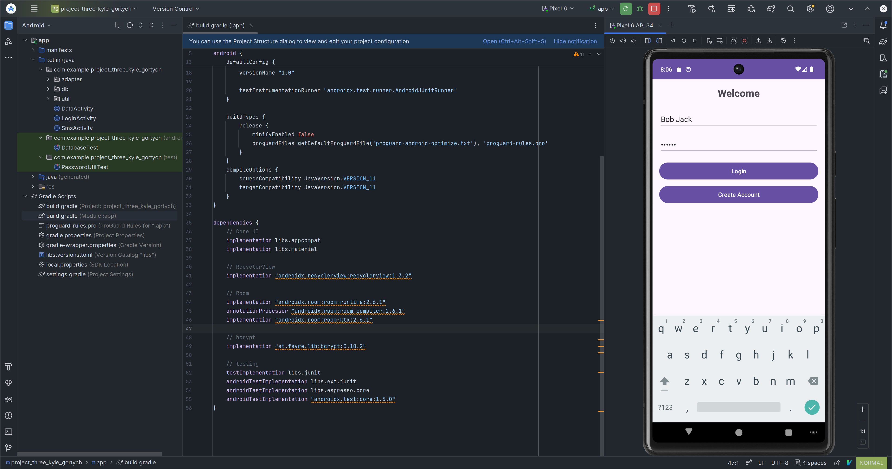
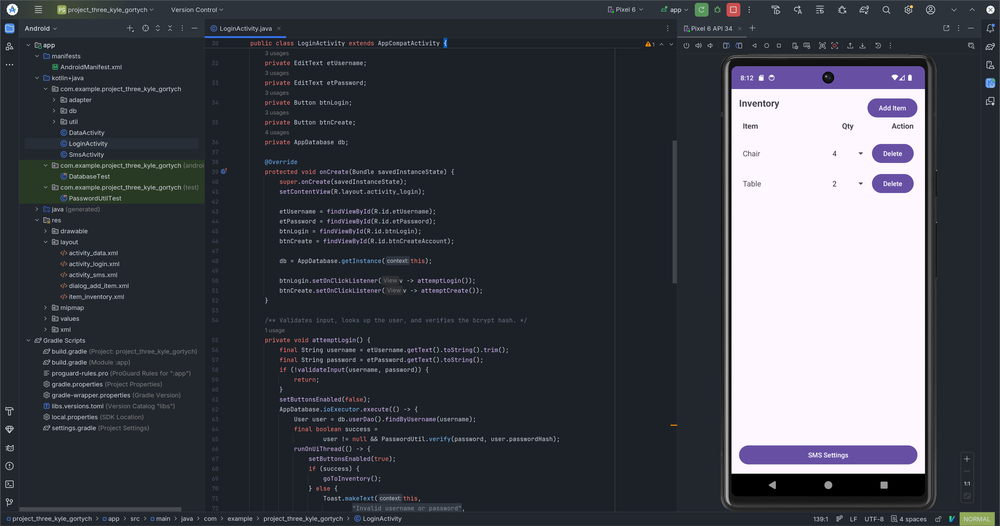

<div align="right">
 


</div>

# cs-360-mobile-architect-programming-8-3
Project work from Mobile Architect and Programming 


## About
This android studio project shows a simple inventory tracking app.

## Motivation
To show the work done in CS 360 Mobile Architect and Programming from SNHU.

## Getting Started
Setup is done via `git clone url`.

Then the dependecies to add are in the app/src/build.gradle file

## Installation

### Tools
Installation best via a system level package manager or ephemeral build environment.
Transitvie dependecies such as language are shown via tree level.

- git
- java

## Reflection

### Briefly summarize the requirements and goals of the app you developed. What user needs was this app designed to address?
The requrinments and goals where to,

This application will be used to track items in a warehouse. This application must include the following features:

- A database with at least two tables, one to store the inventory items and one to store user logins and passwords
- A screen for logging into the app
    - Note that the screen for logging into the app should also be used to create a login if the user has never logged in before.
- A screen with a grid that displays all items in the inventory
- A mechanism by which the user can add and remove items from the inventory
- A mechanism by which the user can increase or decrease the number of a specific item in the inventory
- A mechanism by which the application will notify the user when the amount of any item in the inventory has been reduced to zero

### What screens and features were necessary to support user needs and produce a user-centered UI for the app? How did your UI designs keep users in mind? Why were your designs successful?
There needed to be a login screen and a page for the user to add and delete items. I kept the UI design simple and used a list layour with buttons at the top. Overall the UI desing was partially successful but, in the future could use a more modern theme and optimized layout.

### How did you approach the process of coding your app? What techniques or strategies did you use? How could those techniques or strategies be applied in the future?
I first thouch about the what the user requried. This would help in determining what functional and non functional requrinments were. Then I researched which libaries to use that would be most effective in terms of perfromance and simplicity. 

### How did you test to ensure your code was functional? Why is this process important, and what did it reveal?
I had two test files to ensure the code worked correctly. It was important to use mocking as remote testing would take too long and use up more reasources than needed. 

### Consider the full app design and development process from initial planning to finalization. Where did you have to innovate to overcome a challenge?
I first thought about using argon2 but decided on bcrypt due to being simpler to implment. In the future I would use the more secure argon2 for a better security standard for endusers.

### In what specific component of your mobile app were you particularly successful in demonstrating your knowledge, skills, and experience?
A major part of the app that was effective in showing what I have learned from this class was the use of the android studio emulator. being able to see how the application actually runs in real time helps in understanding how the enduser interacts with the application. It also shows any potential issues like latency or performance. 

## Design Overview

<details>
<summary>Click to see</summary>

### Code Examples

#### AndroidManifest to set entrypoint as LoginActivity.java

<details>
<summary>Click to see</summary>

```xml
<?xml version="1.0" encoding="utf-8"?>
<manifest xmlns:android="http://schemas.android.com/apk/res/android">

    <uses-permission android:name="android.permission.SEND_SMS" />

    <application
        android:allowBackup="false"
        android:icon="@mipmap/ic_launcher"
        android:roundIcon="@mipmap/ic_launcher_round"
        android:label="@string/app_name"
        android:supportsRtl="true"
        android:theme="@style/Theme.Material3.DayNight.NoActionBar">

        <!-- LoginActivity is the entry point -->
        <activity
            android:name=".LoginActivity"
            android:exported="true">
            <intent-filter>
                <action android:name="android.intent.action.MAIN" />
                <category android:name="android.intent.category.LAUNCHER" />
            </intent-filter>
        </activity>

        <activity
            android:name=".DataActivity"
            android:exported="false" />

        <activity
            android:name=".SmsActivity"
            android:exported="false" />

    </application>

</manifest>
```
</details>

#### LoginActivity.java

<details>
<summary>Click to see</summary>

```java
package com.example.project_three_kyle_gortych;

import android.content.Intent;
import android.os.Bundle;
import android.widget.Button;
import android.widget.EditText;
import android.widget.Toast;

import androidx.appcompat.app.AppCompatActivity;

import com.example.project_three_kyle_gortych.db.AppDatabase;
import com.example.project_three_kyle_gortych.db.User;
import com.example.project_three_kyle_gortych.util.PasswordUtil;

/**
 * Single screen that handles both login and first-time account creation.
 *
 * <ul>
 *   <li>Tapping <b>Login</b> looks up the username, verifies the password
 *       against the stored bcrypt hash, and on success starts
 *       {@link DataActivity}.</li>
 *   <li>Tapping <b>Create Account</b> inserts a new {@link User} row with a
 *       freshly hashed password, then drops straight into the inventory
 *       screen.</li>
 * </ul>
 *
 * All database and bcrypt work happens on {@link AppDatabase#ioExecutor}
 * so the UI thread never blocks on SQLite or hashing.
 */
public class LoginActivity extends AppCompatActivity {

    private EditText etUsername;
    private EditText etPassword;
    private Button btnLogin;
    private Button btnCreate;
    private AppDatabase db;

    @Override
    protected void onCreate(Bundle savedInstanceState) {
        super.onCreate(savedInstanceState);
        setContentView(R.layout.activity_login);

        etUsername = findViewById(R.id.etUsername);
        etPassword = findViewById(R.id.etPassword);
        btnLogin = findViewById(R.id.btnLogin);
        btnCreate = findViewById(R.id.btnCreateAccount);

        db = AppDatabase.getInstance(this);

        btnLogin.setOnClickListener(v -> attemptLogin());
        btnCreate.setOnClickListener(v -> attemptCreate());
    }

    /** Validates input, looks up the user, and verifies the bcrypt hash. */
    private void attemptLogin() {
        final String username = etUsername.getText().toString().trim();
        final String password = etPassword.getText().toString();
        if (!validateInput(username, password)) {
            return;
        }
        setButtonsEnabled(false);
        AppDatabase.ioExecutor.execute(() -> {
            User user = db.userDao().findByUsername(username);
            final boolean success =
                    user != null && PasswordUtil.verify(password, user.passwordHash);
            runOnUiThread(() -> {
                setButtonsEnabled(true);
                if (success) {
                    goToInventory();
                } else {
                    Toast.makeText(this,
                            R.string.err_invalid_credentials,
                            Toast.LENGTH_SHORT).show();
                }
            });
        });
    }

    /** Validates input, enforces uniqueness, hashes the password and inserts. */
    private void attemptCreate() {
        final String username = etUsername.getText().toString().trim();
        final String password = etPassword.getText().toString();
        if (!validateInput(username, password)) {
            return;
        }
        if (password.length() < 4) {
            Toast.makeText(this,
                    R.string.err_short_password,
                    Toast.LENGTH_SHORT).show();
            return;
        }
        setButtonsEnabled(false);
        AppDatabase.ioExecutor.execute(() -> {
            User existing = db.userDao().findByUsername(username);
            if (existing != null) {
                runOnUiThread(() -> {
                    setButtonsEnabled(true);
                    Toast.makeText(this,
                            R.string.err_user_exists,
                            Toast.LENGTH_SHORT).show();
                });
                return;
            }
            // Hashing is CPU-intensive – we are already off the UI thread here.
            String hash = PasswordUtil.hash(password);
            db.userDao().insert(new User(username, hash));
            runOnUiThread(() -> {
                setButtonsEnabled(true);
                Toast.makeText(this,
                        R.string.create_account_success,
                        Toast.LENGTH_SHORT).show();
                goToInventory();
            });
        });
    }

    /** Returns {@code true} iff both fields are non-empty. */
    private boolean validateInput(String u, String p) {
        if (u.isEmpty() || p.isEmpty()) {
            Toast.makeText(this,
                    R.string.err_empty_fields,
                    Toast.LENGTH_SHORT).show();
            return false;
        }
        return true;
    }

    /** Disables buttons during DB work to stop double-taps. */
    private void setButtonsEnabled(boolean enabled) {
        btnLogin.setEnabled(enabled);
        btnCreate.setEnabled(enabled);
    }

    /** Navigates to the inventory grid and finishes the login screen. */
    private void goToInventory() {
        startActivity(new Intent(this, DataActivity.class));
        finish();
    }
}
```

</details>

#### Unit Test

<details>
<summary>Click to see</summary>

```java
package com.example.project_three_kyle_gortych;

import static org.junit.Assert.assertFalse;
import static org.junit.Assert.assertNotEquals;
import static org.junit.Assert.assertNotNull;
import static org.junit.Assert.assertTrue;

import com.example.project_three_kyle_gortych.util.PasswordUtil;

import org.junit.Test;

/**
 * Local JVM unit tests for {@link PasswordUtil}. These do not require an
 * Android device because bcrypt is pure Java. Run with
 * {@code ./gradlew test} or from Android Studio's test runner.
 */
public class PasswordUtilTest {

    @Test
    public void hash_producesNonEmptyStringDifferentFromInput() {
        String hash = PasswordUtil.hash("correct horse battery staple");
        assertNotNull(hash);
        assertFalse(hash.isEmpty());
        assertNotEquals("correct horse battery staple", hash);
    }

    @Test
    public void verify_returnsTrueForMatchingPassword() {
        String hash = PasswordUtil.hash("letmein");
        assertTrue(PasswordUtil.verify("letmein", hash));
    }

    @Test
    public void verify_returnsFalseForWrongPassword() {
        String hash = PasswordUtil.hash("letmein");
        assertFalse(PasswordUtil.verify("letmeout", hash));
    }

    @Test
    public void verify_isCaseSensitive() {
        String hash = PasswordUtil.hash("Password1");
        assertFalse(PasswordUtil.verify("password1", hash));
    }

    @Test
    public void hash_producesDifferentOutputsForSameInput() {
        // bcrypt includes a random salt, so two hashes of the same password
        // must not be identical – and both must still verify.
        String h1 = PasswordUtil.hash("same-input");
        String h2 = PasswordUtil.hash("same-input");
        assertNotEquals(h1, h2);
        assertTrue(PasswordUtil.verify("same-input", h1));
        assertTrue(PasswordUtil.verify("same-input", h2));
    }

    @Test
    public void verify_handlesNullSafely() {
        String hash = PasswordUtil.hash("x");
        assertFalse(PasswordUtil.verify(null, hash));
        assertFalse(PasswordUtil.verify("x", null));
        assertFalse(PasswordUtil.verify(null, null));
    }

    @Test
    public void verify_returnsFalseForMalformedHash() {
        // Not a bcrypt string at all – should be treated as a mismatch
        // rather than crashing.
        assertFalse(PasswordUtil.verify("anything", "not-a-real-hash"));
    }
}
```

</details>

#### Integration Test

<details>
<summary>Click to see</summary>

```java
package com.example.project_three_kyle_gortych;

import static org.junit.Assert.assertEquals;
import static org.junit.Assert.assertNotNull;
import static org.junit.Assert.assertNull;
import static org.junit.Assert.assertTrue;
import static org.junit.Assert.fail;

import android.content.Context;

import androidx.room.Room;
import androidx.test.core.app.ApplicationProvider;
import androidx.test.ext.junit.runners.AndroidJUnit4;

import com.example.project_three_kyle_gortych.db.AppDatabase;
import com.example.project_three_kyle_gortych.db.InventoryDao;
import com.example.project_three_kyle_gortych.db.InventoryItem;
import com.example.project_three_kyle_gortych.db.User;
import com.example.project_three_kyle_gortych.db.UserDao;
import com.example.project_three_kyle_gortych.util.PasswordUtil;

import org.junit.After;
import org.junit.Before;
import org.junit.Test;
import org.junit.runner.RunWith;

import java.util.List;

/**
 * Instrumented tests for the Room database. These run on a device or
 * emulator (Build &gt; Run &gt; select device) rather than on the JVM,
 * because Room generates code that depends on the Android SQLite bindings.
 *
 * <p>Each test uses an in-memory database that is destroyed in
 * {@link #closeDb()}, so tests cannot interfere with each other or with
 * real user data.
 */
@RunWith(AndroidJUnit4.class)
public class DatabaseTest {

    private AppDatabase db;
    private UserDao userDao;
    private InventoryDao inventoryDao;

    @Before
    public void createDb() {
        Context ctx = ApplicationProvider.getApplicationContext();
        // inMemoryDatabaseBuilder + allowMainThreadQueries keeps these tests
        // simple – real application code still goes through ioExecutor.
        db = Room.inMemoryDatabaseBuilder(ctx, AppDatabase.class)
                .allowMainThreadQueries()
                .build();
        userDao = db.userDao();
        inventoryDao = db.inventoryDao();
    }

    @After
    public void closeDb() {
        db.close();
    }

    // --- User table --------------------------------------------------------

    @Test
    public void insertUser_thenFind_returnsSameRow() {
        String hash = PasswordUtil.hash("secret");
        userDao.insert(new User("alice", hash));

        User found = userDao.findByUsername("alice");
        assertNotNull(found);
        assertEquals("alice", found.username);
        assertTrue(PasswordUtil.verify("secret", found.passwordHash));
    }

    @Test
    public void findByUsername_returnsNullForMissingUser() {
        assertNull(userDao.findByUsername("ghost"));
    }

    @Test
    public void insertDuplicateUsername_throws() {
        userDao.insert(new User("bob", "h1"));
        try {
            userDao.insert(new User("bob", "h2"));
            fail("Duplicate insert should have thrown");
        } catch (Exception expected) {
            // Room wraps the SQLite constraint violation; any exception is
            // acceptable here.
        }
    }

    // --- Inventory table ---------------------------------------------------

    @Test
    public void insertInventoryItem_appearsInGetAllSync() {
        inventoryDao.insert(new InventoryItem("Widget", 5));
        List<InventoryItem> items = inventoryDao.getAllSync();
        assertEquals(1, items.size());
        assertEquals("Widget", items.get(0).name);
        assertEquals(5, items.get(0).quantity);
    }

    @Test
    public void updateInventoryItem_persistsNewQuantity() {
        inventoryDao.insert(new InventoryItem("Widget", 5));
        InventoryItem item = inventoryDao.getAllSync().get(0);

        item.quantity = 0;
        inventoryDao.update(item);

        List<InventoryItem> after = inventoryDao.getAllSync();
        assertEquals(1, after.size());
        assertEquals(0, after.get(0).quantity);
    }

    @Test
    public void deleteInventoryItem_removesRow() {
        inventoryDao.insert(new InventoryItem("Widget", 5));
        InventoryItem item = inventoryDao.getAllSync().get(0);

        inventoryDao.delete(item);

        assertTrue(inventoryDao.getAllSync().isEmpty());
    }

    @Test
    public void getAllSync_ordersByNameCaseInsensitive() {
        inventoryDao.insert(new InventoryItem("banana", 1));
        inventoryDao.insert(new InventoryItem("Apple", 2));
        inventoryDao.insert(new InventoryItem("cherry", 3));

        List<InventoryItem> items = inventoryDao.getAllSync();
        assertEquals(3, items.size());
        assertEquals("Apple", items.get(0).name);
        assertEquals("banana", items.get(1).name);
        assertEquals("cherry", items.get(2).name);
    }
}
```

</details>

</details>

### Screenshots of Application

<div align="center">
  
</div>

<div align="center">
  
</div>
